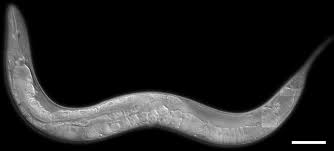

# TensorFlow Caenorhabditis elegans and Halicephalobus mephisto Image Classifier

This is the repository developed to classify two different organism from their scientific images using this [CodeLab](https://codelabs.developers.google.com/codelabs/tensorflow-for-poets/?utm_campaign=chrome_series_machinelearning_063016&utm_source=gdev&utm_medium=yt-desc#0) guide by Google.

One can use this repository as itself or can add more categories to the classifier. To add more categories, follow the CodeLab guide given above.

##Requirements

* [docker](https://www.docker.com/products/docker-toolbox)

##Usage

1. Start the docker image `docker run -it -v <absolute_path_to_this_directory>:/tf_files/ gcr.io/tensorflow/tensorflow:latest-devel`

2. Run the label_image script to label the image. `python /tf_files/label_image.py <path_to_file>`

##Results

###Accuracy

###Test Result with C elegans Image

###Test Result with H mephisto Image

