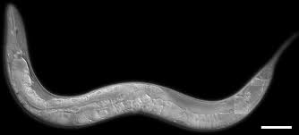
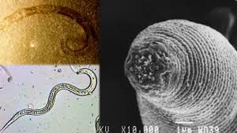
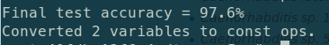
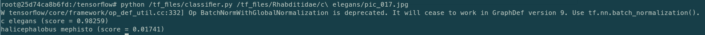
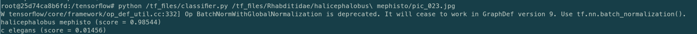

# TensorFlow Caenorhabditis elegans and Halicephalobus mephisto Image Classifier

This is the repository developed to classify two different organism from their scientific images using this [CodeLab](https://codelabs.developers.google.com/codelabs/tensorflow-for-poets/?utm_campaign=chrome_series_machinelearning_063016&utm_source=gdev&utm_medium=yt-desc#0) guide by Google.

To develop this classifier, [TensorFlow](https://github.com/tensorflow/tensorflow) framework and the famous [Inception](https://github.com/tensorflow/models/tree/master/inception) model are used. What is done to get this repository is basically retraining Inception's final layer for our categories which are Caenorhabditis elegans and Halicephalobus mephisto.





##Results

###Accuracy

###Test Result with C elegans Image

###Test Result with H mephisto Image



##Dependencies

* [docker](https://www.docker.com/products/docker-toolbox)

##Where is where?

Our classifier script is `classifier.py` as one can easily guess :)
Image data that used for retraining of final layer can be found under the rhabditidae folder. To understand what other parts of the repository required for, you can check retraining script of the TensorFlow from [here](https://github.com/tensorflow/tensorflow/blob/master/tensorflow/examples/image_retraining/retrain.py).


## Install

```bash
cd $HOME
git clone https://github.com/AhmetCanSolak/rhabditidae-image-classifier-tensorflow
mkdir tf_files
cd tf_files
cp -rf $HOME/rhabditidae-image-classifier-tensorflow/* .
```

##Usage

1. Start the docker image `docker run -it -v $HOME/tf_files:/tf_files/ gcr.io/tensorflow/tensorflow:latest-devel`

2. Run the classifier script to label the image. `python /tf_files/classifier.py <path_to_image>`


##Do you have other categories to recognize?

1. Open a new folder under rhabditidae folder with name of the category you want to add.

2. Put the images of the corresponding category into this folder.

3. Start docker image again and run the command:
  ```bash
  python tensorflow/examples/image_retraining/retrain.py \
  --bottleneck_dir=/tf_files/bottlenecks \
  --how_many_training_steps 500 \
  --model_dir=/tf_files/inception \
  --output_graph=/tf_files/retrained_graph.pb \
  --output_labels=/tf_files/retrained_labels.txt \
  --image_dir /tf_files/rhabditidae
  ```

4. Run the classifier script again to check new category label. `python /tf_files/classifier.py <path_to_image>`

## Licence

GPLv3 Licence.
